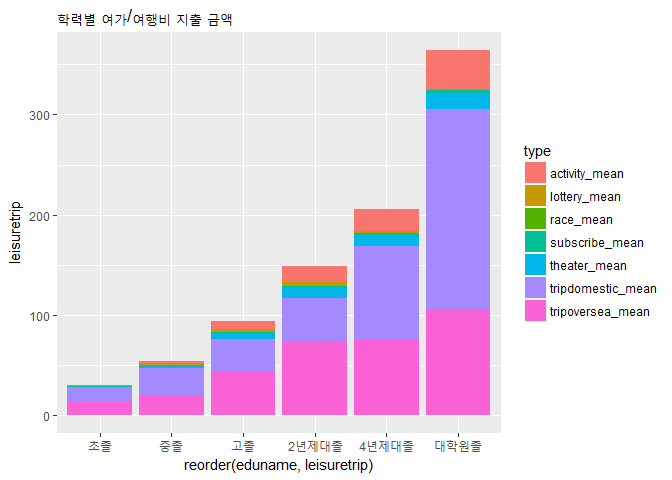
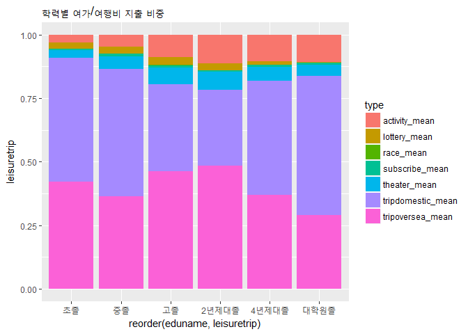
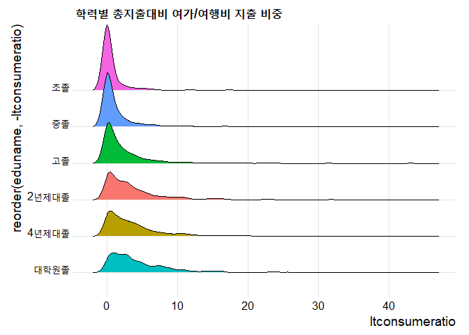
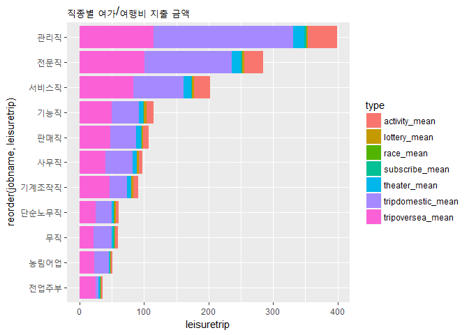
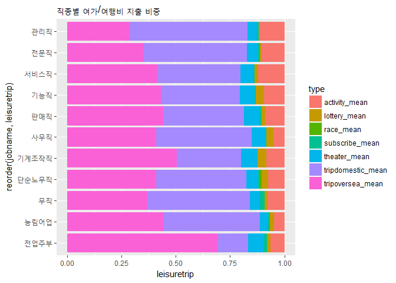
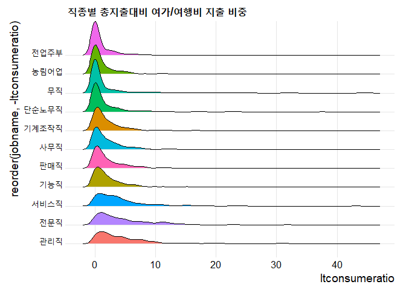

Untitled
================

``` r
#패키지 로드
library(dplyr)
```

    ## 
    ## Attaching package: 'dplyr'

    ## The following objects are masked from 'package:stats':
    ## 
    ##     filter, lag

    ## The following objects are masked from 'package:base':
    ## 
    ##     intersect, setdiff, setequal, union

``` r
library(ggplot2)


#데이터 로드 및 복사본 생성
data <- read.csv('NaSTaB09H.csv', header = T)
data2 <- data


#변수명 수정
data2 <- rename(data2, consume = h09exp,
                leisuretot = h09exp_ch,
                media = h09ch002,
                theater = h09ch004,
                race = h09ch006,
                lottery = h09ch009,
                subscribe = h09ch011,
                activity = h09ch013,
                triptot = h09cn002,
                tripoversea = h09cn007,
                tripdomestic = h09cn010,
                fam_num = h09aa007,
                fam_num1 = w09fnum,
                edu = w09edu01,
                edugraduation = w09grd01,
                job = w09job01)

#사용할 데이터만 할당한 새 데이터프레임 생성
data3 <- data2 %>% 
  select(consume
         ,leisuretot
         ,theater
         ,race
         ,lottery
         ,subscribe
         ,activity
         ,triptot
         ,tripoversea
         ,tripdomestic
         ,fam_num
         ,fam_num1
         ,edu
         ,edugraduation
         ,job)
dim(data3)
```

    ## [1] 4832   15

``` r
str(data3)
```

    ## 'data.frame':    4832 obs. of  15 variables:
    ##  $ consume      : num  4595 1242 503 1610 2413 ...
    ##  $ leisuretot   : num  0 0 0 380 0 0 0 0 0 0 ...
    ##  $ theater      : num  NA NA NA NA NA NA NA NA NA NA ...
    ##  $ race         : num  NA NA NA NA NA NA NA NA NA NA ...
    ##  $ lottery      : num  NA NA NA NA NA NA NA NA NA NA ...
    ##  $ subscribe    : num  NA NA NA NA NA NA NA NA NA NA ...
    ##  $ activity     : num  NA NA NA 360 NA NA NA NA NA NA ...
    ##  $ triptot      : int  130 NA NA NA 300 NA 50 NA 30 300 ...
    ##  $ tripoversea  : int  130 NA NA NA NA NA 50 NA 30 300 ...
    ##  $ tripdomestic : int  NA NA NA NA 300 NA NA NA NA NA ...
    ##  $ fam_num      : int  4 1 1 3 2 2 2 2 2 1 ...
    ##  $ fam_num1     : int  4 1 1 3 2 2 2 2 2 1 ...
    ##  $ edu          : int  5 4 2 6 4 2 6 2 NA NA ...
    ##  $ edugraduation: int  2 2 4 4 2 2 2 2 NA NA ...
    ##  $ job          : int  3 9 9 9 9 13 13 9 NA NA ...

``` r
#결측치 확인
table(is.na(data3$consume)) 
```

    ## 
    ## FALSE  TRUE 
    ##  4040   792

``` r
table(is.na(data3$leisuretot)) 
```

    ## 
    ## FALSE  TRUE 
    ##  4831     1

``` r
table(is.na(data3$theater)) 
```

    ## 
    ## FALSE  TRUE 
    ##  2490  2342

``` r
table(is.na(data3$race))
```

    ## 
    ## FALSE  TRUE 
    ##     4  4828

``` r
table(is.na(data3$lottery)) 
```

    ## 
    ## FALSE  TRUE 
    ##   612  4220

``` r
table(is.na(data3$subscribe)) 
```

    ## 
    ## FALSE  TRUE 
    ##   346  4486

``` r
table(is.na(data3$activity)) 
```

    ## 
    ## FALSE  TRUE 
    ##   699  4133

``` r
table(is.na(data3$triptot))
```

    ## 
    ## FALSE  TRUE 
    ##  2458  2374

``` r
table(is.na(data3$tripdomestic)) 
```

    ## 
    ## FALSE  TRUE 
    ##   738  4094

``` r
table(is.na(data3$tripoversea)) 
```

    ## 
    ## FALSE  TRUE 
    ##  2165  2667

``` r
table(is.na(data3$fam_num))
```

    ## 
    ## FALSE 
    ##  4832

``` r
table(is.na(data3$fam_num1)) 
```

    ## 
    ## FALSE 
    ##  4832

``` r
table(is.na(data3$edu)) 
```

    ## 
    ## FALSE  TRUE 
    ##  4501   331

``` r
table(is.na(data3$edugraduation)) 
```

    ## 
    ## FALSE  TRUE 
    ##  4340   492

``` r
table(is.na(data3$job))
```

    ## 
    ## FALSE  TRUE 
    ##  4501   331

``` r
#종속변수인 지출비 항목은 분석 중에 mean, sum 등 연산과정이 필요하므로 결측치를 0으로 대체
data3$leisuretot <- ifelse(is.na(data3$leisuretot), 0, data3$leisuretot)
data3$theater <- ifelse(is.na(data3$theater), 0, data3$theater)
data3$race <- ifelse(is.na(data3$race), 0, data3$race)
data3$lottery <- ifelse(is.na(data3$lottery), 0, data3$lottery)
data3$subscribe <- ifelse(is.na(data3$subscribe), 0, data3$subscribe)
data3$activity <- ifelse(is.na(data3$activity), 0, data3$activity)
data3$triptot <- ifelse(is.na(data3$triptot), 0, data3$triptot)
data3$tripoversea <- ifelse(is.na(data3$tripoversea), 0, data3$tripoversea)
data3$tripdomestic <- ifelse(is.na(data3$tripdomestic), 0, data3$tripdomestic)

#여가/여행비는 값이 0인 관측치가 존재하더라도 논리적으로는 문제가 없지만. 그러나 총소비지출이 결측치 또는 0인 경우 논리적으로 문제가 있으므로 총소비지출 변수에서 결측치가 존재하는 관측치는 제외하겠다.
data3 <- data3 %>% filter(!is.na(consume))


#1)학력별 여가/여행비 지출분석
#학력변수 정리
#학력기준은 '가구주'입니다
#edu = 가구주의 최종학력, edugraduation = 졸업여부
#edugraduation = 졸업여부변수 항목 확인
table(data3$edugraduation)
```

    ## 
    ##    1    2    3    4 
    ##   21 3433   12  123

``` r
#졸업여부변수 확인 결과 2(졸업)이 나머지 1(재학),3(수료),4(중퇴)보다 현저히 많음. 수료는 졸업과 같다고 간주하고 졸업,수료를 제외한 나머지 항목을 필터링하여 학력별 졸업자만 대상으로 분석.
data3edu <- data3 %>% 
  filter(edugraduation %in% c(2, 3))
#학력, 졸업여부 변수의 결측치 확인
table(is.na(data3edu$edu)) 
```

    ## 
    ## FALSE 
    ##  3445

``` r
table(is.na(data3edu$edugraduation)) 
```

    ## 
    ## FALSE 
    ##  3445

``` r
#학력분포 확인 (2 = 초졸, 3 = 중졸, 4 = 고졸,5 = 2년제대졸,6 = 4년제대졸, 7 = 석사졸, 8 = 박사졸)
table(data3edu$edu)
```

    ## 
    ##    2    3    4    5    6    7    8 
    ##  397  374 1169  331 1013  127   34

``` r
#학력변수(edu) 내의 값을 기준으로 학력명변수(eduname) 생성 및 학력명 할당 및 확인. 박사졸의 관측치의 수가 적었기 때문에 석사졸과 박사졸을 대학원졸이라는 값으로 통합하여 할당했음. 
edudf <- data.frame(edu = c(2,3,4,5,6,7,8),
                    eduname = c('초졸', '중졸', '고졸','2년제대졸','4년제대졸', '대학원졸', '대학원졸'))
data3edu <- left_join(data3edu, edudf, by = 'edu')
#학력별 분포
table(data3edu$eduname)
```

    ## 
    ## 2년제대졸 4년제대졸      고졸  대학원졸      중졸      초졸 
    ##       331      1013      1169       161       374       397

``` r
#학력별로 비교하기 위해 학력으로 그룹을 만들고 학력그룹당 여가/여행비 평균값 변수를 생성
data3edu2 <- data3edu %>%
  group_by(eduname) %>% 
  summarise(theater_mean = mean(theater),
            race_mean = mean(race),
            lottery_mean = mean(lottery),
            subscribe_mean = mean(subscribe),
            activity_mean = mean(activity),
            tripoversea_mean = mean(tripoversea),
            tripdomestic_mean = mean(tripdomestic),
            triptot_mean = mean(triptot),
            leisure_mean = mean(leisuretot),
            consume_mean = mean(consume))

#학력별로 모든 여가/여행비를 비교하기 위해 데이터 구조 변형
a2 <- as.vector(t(data3edu2))
head(a2)
```

    ## [1] "2년제대졸"  "10.5392749" "0.00000000" "4.0543807"  "0.9181269" 
    ## [6] "16.6978852"

``` r
#변형된 데이터를 새 데이터프레임 변수에 저장
edudf2 <- data.frame(leisuretrip = c(a2[2:11],a2[13:22],a2[24:33],a2[35:44],a2[46:55],a2[57:66]), eduname = c('2년제대졸','2년제대졸','2년제대졸','2년제대졸','2년제대졸','2년제대졸','2년제대졸','2년제대졸','2년제대졸','2년제대졸','4년제대졸','4년제대졸','4년제대졸','4년제대졸','4년제대졸','4년제대졸','4년제대졸','4년제대졸','4년제대졸','4년제대졸','고졸','고졸','고졸','고졸','고졸','고졸','고졸','고졸','고졸','고졸','대학원졸','대학원졸','대학원졸','대학원졸','대학원졸','대학원졸','대학원졸','대학원졸','대학원졸','대학원졸','중졸','중졸','중졸','중졸','중졸','중졸','중졸','중졸','중졸','중졸','초졸','초졸','초졸','초졸','초졸','초졸','초졸','초졸','초졸','초졸'), type = c('theater_mean','race_mean','lottery_mean','subscribe_mean','activity_mean','tripoversea_mean','tripdomestic_mean','triptot_mean','leisuretot_mean','consume_mean','theater_mean','race_mean','lottery_mean','subscribe_mean','activity_mean','tripoversea_mean','tripdomestic_mean','triptot_mean','leisuretot_mean','consume_mean','theater_mean','race_mean','lottery_mean','subscribe_mean','activity_mean','tripoversea_mean','tripdomestic_mean','triptot_mean','leisuretot_mean','consume_mean','theater_mean','race_mean','lottery_mean','subscribe_mean','activity_mean','tripoversea_mean','tripdomestic_mean','triptot_mean','leisuretot_mean','consume_mean','theater_mean','race_mean','lottery_mean','subscribe_mean','activity_mean','tripoversea_mean','tripdomestic_mean','triptot_mean','leisuretot_mean','consume_mean','theater_mean','race_mean','lottery_mean','subscribe_mean','activity_mean','tripoversea_mean','tripdomestic_mean','triptot_mean','leisuretot_mean','consume_mean'))

#변수타입 확인
head(edudf2)
```

    ##   leisuretrip   eduname             type
    ## 1  10.5392749 2년제대졸     theater_mean
    ## 2  0.00000000 2년제대졸        race_mean
    ## 3   4.0543807 2년제대졸     lottery_mean
    ## 4   0.9181269 2년제대졸   subscribe_mean
    ## 5  16.6978852 2년제대졸    activity_mean
    ## 6    72.47734 2년제대졸 tripoversea_mean

``` r
class(edudf2$leisuretrip)
```

    ## [1] "factor"

``` r
#변수타입이 factor일 때에는 양적으로 비교가 불가능하므로 변수타입을 factor 에서 numeric으로 변환
edudf2$leisuretrip <- as.numeric(as.character(edudf2$leisuretrip))

#학력별 여가/여행비 지출 금액
edudf3 <- edudf2 %>% filter(type %in% c('theater_mean','race_mean','lottery_mean','subscribe_mean','activity_mean','tripoversea_mean','tripdomestic_mean'))

ggplot(data = edudf3, aes(x = reorder(eduname, leisuretrip), y = leisuretrip, fill = type)) +        geom_col() +
  ggtitle('학력별 여가/여행비 지출 금액')
```



``` r
#주1. 학력이 높아질수록 총 여가/여행비또한 증가하고 있음
#학력별 여가/여행비 지출 비중
ggplot(data = edudf3, aes(x = reorder(eduname, leisuretrip), y = leisuretrip, fill = type)) + geom_col(position='fill') +
  ggtitle('학력별 여가/여행비 지출 비중')
```



``` r
##주1. 초졸->2년제대졸까지 활동비 점진적 증가함
##주2. 중졸->2년제대졸까지 국내여행지출은 줄고 해외여행지출은 늘다가 4년제대졸부터 반대
##주3. 복권지출비중 초졸->비슷하다가 4년제대졸부터 감소

#학력별 총 지출 대비 여가/여행비 지출 평균
#학력별 총 지출 대비 여가/여행비 지출 평균변수 생성
data3edu <- data3edu %>% mutate(ltconsumeratio = (leisuretot + triptot) / consume * 100)
#학력별 총 지출 대비 여가/여행비 지출 평균값 확인
ltconsumeratio_mean <- data3edu %>%
  group_by(eduname) %>% 
  summarise(ltconsumeratio_mean = mean(ltconsumeratio))

ltconsumeratio_mean
```

    ## # A tibble: 6 x 2
    ##   eduname   ltconsumeratio_mean
    ##   <fct>                   <dbl>
    ## 1 2년제대졸                3.49
    ## 2 4년제대졸                3.92
    ## 3 고졸                     2.24
    ## 4 대학원졸                 5.07
    ## 5 중졸                     1.66
    ## 6 초졸                     1.10

``` r
#학력별 총지출대비 여가/여행비 지출 비중 그래프
#그래프를 생성하기 위한 패키지 로드 및 그래프 생성
library(ggridges)

ggplot(data3edu, aes(x = ltconsumeratio, y = reorder(eduname, -ltconsumeratio), fill = eduname)) +
  geom_density_ridges() +
  theme_ridges() + 
  theme(legend.position = "none") +
  ggtitle('학력별 총지출대비 여가/여행비 지출 비중')
```

    ## Picking joint bandwidth of 0.645



``` r
#위의 그래프에서 확인한 것 처럼 학력별 총지출대비 여가/여행비 지출 비중의 차이가 유의한지 검정하기 위해 분산분석

aov1  <- aov(ltconsumeratio ~ eduname, data = data3edu)
summary(aov1)
```

    ##               Df Sum Sq Mean Sq F value Pr(>F)    
    ## eduname        5   4263   852.6   48.78 <2e-16 ***
    ## Residuals   3439  60101    17.5                   
    ## ---
    ## Signif. codes:  0 '***' 0.001 '**' 0.01 '*' 0.05 '.' 0.1 ' ' 1

``` r
#F값이 48.78로 자유도가 5인 F분포에서 유의확률(P-value)이 0.01이하의 매우 작은 값이 나왔으므로 유의수준 0.01 하에서 귀무가설을 기각할 수 있다. 학력간의 여가/여행비 지출 비중의 차이가 유의하다고 주장가능하다. 따라서 학력이 높아질수록 여가/여행비 지출 비중이 늘어난다고 할 수 있다.
```

``` r
#2)직종별 여가/여행비 지출분석
#job = 가구주의 최종학력
#결측치 확인 및 제거
table(is.na(data3$job))
```

    ## 
    ## FALSE  TRUE 
    ##  3743   297

``` r
data3job <- data3 %>%
  filter(!is.na(job))
#직종분포 확인 (1 = 관리직, 2 = 전문직, 3 = 서비스직, 4 = 사무직, 5 = 판매직, 6 = 농림어업, 7 = 기능직, 8 = 기계조작직, 9 = 단순노무직, 10 = 직업군인, 11 = 기타취업, 12 = 전업주부, 13 = 무직, 14 = 학생)
table(data3job$job)
```

    ## 
    ##   1   2   3   4   5   6   7   8   9  10  11  12  13  14 
    ## 192 200 618 361 261 251 438 224 292  16   4 188 697   1

``` r
#1 항목은 무응답이고, 10,11,14 항목은 관측치가 충분히 작다고 판단하여 제외
jobdf <- data.frame(job = c(1,2,3,4,5,6,7,8,9,12,13),
                    jobname = c('관리직','전문직','서비스직','사무직','판매직','농림어업','기능직','기계조작직','단순노무직','전업주부','무직'))
data3job <- left_join(data3job, jobdf, by = 'job')
data3job <- data3job %>% filter(jobname %in% c('관리직','전문직','서비스직', '사무직','판매직','농림어업','기능직','기계조작직','단순노무직','전업주부','무직'))
head(data3job)
```

    ##    consume leisuretot theater race lottery subscribe activity triptot
    ## 1 4594.703          0       0    0       0         0        0     130
    ## 2 1242.400          0       0    0       0         0        0       0
    ## 3  503.400          0       0    0       0         0        0       0
    ## 4 1610.000        380       0    0       0         0      360       0
    ## 5 2413.400          0       0    0       0         0        0     300
    ## 6  548.200          0       0    0       0         0        0       0
    ##   tripoversea tripdomestic fam_num fam_num1 edu edugraduation job
    ## 1         130            0       4        4   5             2   3
    ## 2           0            0       1        1   4             2   9
    ## 3           0            0       1        1   2             4   9
    ## 4           0            0       3        3   6             4   9
    ## 5           0          300       2        2   4             2   9
    ## 6           0            0       2        2   2             2  13
    ##      jobname
    ## 1   서비스직
    ## 2 단순노무직
    ## 3 단순노무직
    ## 4 단순노무직
    ## 5 단순노무직
    ## 6       무직

``` r
#직종별 분포
table(data3job$jobname)
```

    ## 
    ##     관리직 기계조작직     기능직   농림어업 단순노무직       무직 
    ##        192        224        438        251        292        697 
    ##     사무직   서비스직     전문직   전업주부     판매직 
    ##        361        618        200        188        261

``` r
#직종별로 비교하기 위해 학력으로 그룹을 만들고 직종그룹당 여가/여행비 평균값 변수를 생성
data3job2 <- data3job %>%
  group_by(jobname) %>% 
  summarise(theater_mean = mean(theater),
            race_mean = mean(race),
            lottery_mean = mean(lottery),
            subscribe_mean = mean(subscribe),
            activity_mean = mean(activity),
            tripoversea_mean = mean(tripoversea),
            tripdomestic_mean = mean(tripdomestic),
            triptot_mean = mean(triptot),
            leisure_mean = mean(leisuretot),
            consume_mean = mean(consume))

#직종별로 모든 여가/여행비를 비교하기 위해 데이터 구조 변형
b2 <- as.vector(t(data3job2))
head(b2)
```

    ## [1] "관리직"     "17.854167"  "0.00000000" "1.9947917"  "3.2468750" 
    ## [6] "45.223958"

``` r
#변형된 데이터를 새 데이터프레임 변수에 저장
jobdf2 <- data.frame(leisuretrip = c(b2[2:11],b2[13:22],b2[24:33],b2[35:44],b2[46:55],b2[57:66],b2[68:77],b2[79:88],b2[90:99],b2[101:110],b2[112:121]), jobname = c('관리직','관리직','관리직','관리직','관리직','관리직','관리직','관리직','관리직','관리직','기계조작직','기계조작직','기계조작직','기계조작직','기계조작직','기계조작직','기계조작직','기계조작직','기계조작직','기계조작직','기능직','기능직','기능직','기능직','기능직','기능직','기능직','기능직','기능직','기능직','농림어업','농림어업','농림어업','농림어업','농림어업','농림어업','농림어업','농림어업','농림어업','농림어업','단순노무직','단순노무직','단순노무직','단순노무직','단순노무직','단순노무직','단순노무직','단순노무직','단순노무직','단순노무직','무직','무직','무직','무직','무직','무직','무직','무직','무직','무직','사무직','사무직','사무직','사무직','사무직','사무직','사무직','사무직','사무직','사무직','서비스직','서비스직','서비스직','서비스직','서비스직','서비스직','서비스직','서비스직','서비스직','서비스직','전문직','전문직','전문직','전문직','전문직','전문직','전문직','전문직','전문직','전문직','전업주부','전업주부','전업주부','전업주부','전업주부','전업주부','전업주부','전업주부','전업주부','전업주부','판매직','판매직','판매직','판매직','판매직','판매직','판매직','판매직','판매직','판매직'), type = c('theater_mean','race_mean','lottery_mean','subscribe_mean','activity_mean','tripoversea_mean','tripdomestic_mean','triptot_mean','leisuretot_mean','consume_mean','theater_mean','race_mean','lottery_mean','subscribe_mean','activity_mean','tripoversea_mean','tripdomestic_mean','triptot_mean','leisuretot_mean','consume_mean','theater_mean','race_mean','lottery_mean','subscribe_mean','activity_mean','tripoversea_mean','tripdomestic_mean','triptot_mean','leisuretot_mean','consume_mean','theater_mean','race_mean','lottery_mean','subscribe_mean','activity_mean','tripoversea_mean','tripdomestic_mean','triptot_mean','leisuretot_mean','consume_mean','theater_mean','race_mean','lottery_mean','subscribe_mean','activity_mean','tripoversea_mean','tripdomestic_mean','triptot_mean','leisuretot_mean','consume_mean','theater_mean','race_mean','lottery_mean','subscribe_mean','activity_mean','tripoversea_mean','tripdomestic_mean','triptot_mean','leisuretot_mean','consume_mean','theater_mean','race_mean','lottery_mean','subscribe_mean','activity_mean','tripoversea_mean','tripdomestic_mean','triptot_mean','leisuretot_mean','consume_mean','theater_mean','race_mean','lottery_mean','subscribe_mean','activity_mean','tripoversea_mean','tripdomestic_mean','triptot_mean','leisuretot_mean','consume_mean','theater_mean','race_mean','lottery_mean','subscribe_mean','activity_mean','tripoversea_mean','tripdomestic_mean','triptot_mean','leisuretot_mean','consume_mean','theater_mean','race_mean','lottery_mean','subscribe_mean','activity_mean','tripoversea_mean','tripdomestic_mean','triptot_mean','leisuretot_mean','consume_mean','theater_mean','race_mean','lottery_mean','subscribe_mean','activity_mean','tripoversea_mean','tripdomestic_mean','triptot_mean','leisuretot_mean','consume_mean'))

#변수타입 확인
head(jobdf2)
```

    ##   leisuretrip jobname             type
    ## 1   17.854167  관리직     theater_mean
    ## 2  0.00000000  관리직        race_mean
    ## 3   1.9947917  관리직     lottery_mean
    ## 4   3.2468750  관리직   subscribe_mean
    ## 5   45.223958  관리직    activity_mean
    ## 6   114.84375  관리직 tripoversea_mean

``` r
class(jobdf2$leisuretrip)
```

    ## [1] "factor"

``` r
#변수타입이 factor일 때에는 양적으로 비교가 불가능하므로 변수타입을 factor 에서 numeric으로 변환
jobdf2$leisuretrip <- as.numeric(as.character(jobdf2$leisuretrip))

#직종별 여가/여행비 지출 금액
jobdf3 <- jobdf2 %>% filter(type %in% c('theater_mean','race_mean','lottery_mean','subscribe_mean','activity_mean','tripoversea_mean','tripdomestic_mean'))

ggplot(data = jobdf3, aes(x = reorder(jobname, leisuretrip), y = leisuretrip, fill = type)) +        geom_col() +
  coord_flip()+
  ggtitle('직종별 여가/여행비 지출 금액')
```



``` r
#주1. 직종이 좋아질수록 총 여가/여행비또한 증가하고 있음
#직종별 여가/여행비 지출 비중
ggplot(data = jobdf3, aes(x = reorder(jobname, leisuretrip), y = leisuretrip, fill = type)) + geom_col(position='fill') +
  coord_flip()+
  ggtitle('직종별 여가/여행비 지출 비중')
```



``` r
#직종별 총 지출 대비 여가/여행비 지출 평균
#직종별 총 지출 대비 여가/여행비 지출 평균변수 생성
data3job <- data3job %>% mutate(ltconsumeratio = (leisuretot + triptot) / consume * 100)
#직종별 총 지출 대비 여가/여행비 지출 평균값 확인
ltconsumeratio_mean <- data3job %>%
  group_by(jobname) %>% 
  summarise(ltconsumeratio_mean = mean(ltconsumeratio))

ltconsumeratio_mean
```

    ## # A tibble: 11 x 2
    ##    jobname    ltconsumeratio_mean
    ##    <fct>                    <dbl>
    ##  1 관리직                    4.94
    ##  2 기계조작직                2.10
    ##  3 기능직                    2.62
    ##  4 농림어업                  1.67
    ##  5 단순노무직                1.92
    ##  6 무직                      1.80
    ##  7 사무직                    2.28
    ##  8 서비스직                  3.94
    ##  9 전문직                    4.77
    ## 10 전업주부                  1.18
    ## 11 판매직                    2.41

``` r
#직종별 총지출대비 여가/여행비 지출 비중 그래프
ggplot(data3job, aes(x = ltconsumeratio, y = reorder(jobname, -ltconsumeratio), fill = jobname)) +
  geom_density_ridges() +
  theme_ridges() + 
  theme(legend.position = "none") +
  ggtitle('직종별 총지출대비 여가/여행비 지출 비중')
```

    ## Picking joint bandwidth of 0.654



``` r
#위의 그래프에서 확인한 것 처럼 직종별 총지출대비 여가/여행비 지출 비중의 차이가 유의한지 검정하기 위해 분산분석

aov2  <- aov(ltconsumeratio ~ jobname, data = data3job)
summary(aov2)
```

    ##               Df Sum Sq Mean Sq F value Pr(>F)    
    ## jobname       10   4381   438.1   25.86 <2e-16 ***
    ## Residuals   3711  62871    16.9                   
    ## ---
    ## Signif. codes:  0 '***' 0.001 '**' 0.01 '*' 0.05 '.' 0.1 ' ' 1

``` r
#F값이 25.86로 자유도가 10인 F분포에서 유의확률(P-value)이 0.01이하의 매우 작은 값이 나왔으므로 유의수준 0.01하에서 귀무가설을 기각할 수 있다. 여가/여행비 지출 비중의 차이가 유의하다고 주장할 수 있다. 따라서 직종이 고도화될수록 여가/여행비 지출 비중이 늘어난다고 할 수 있다.
```
